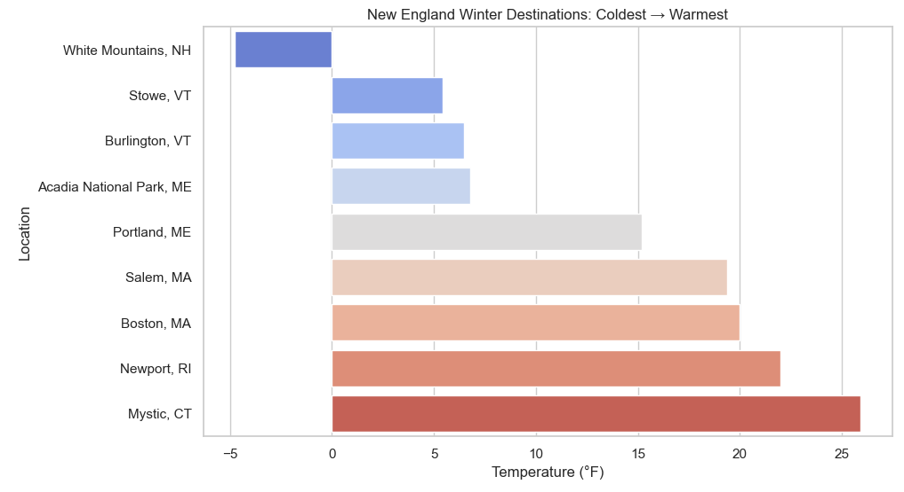
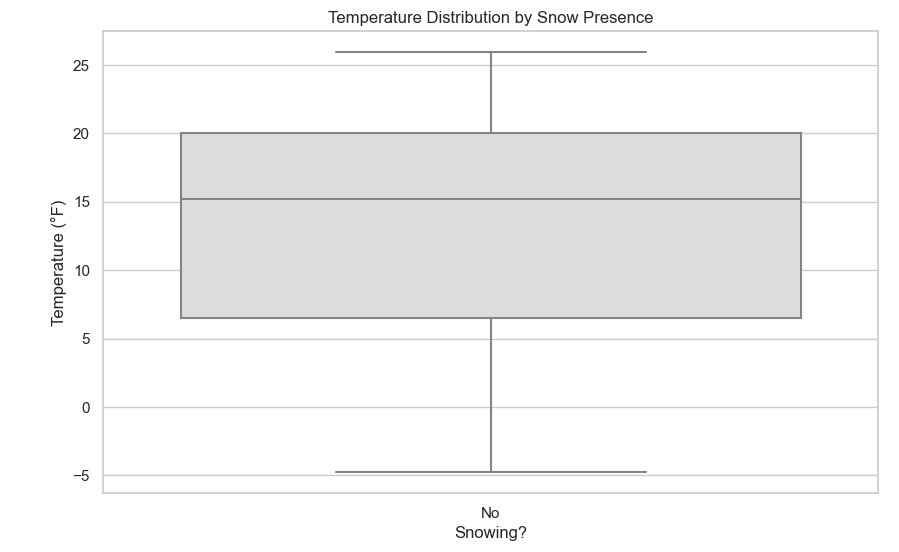
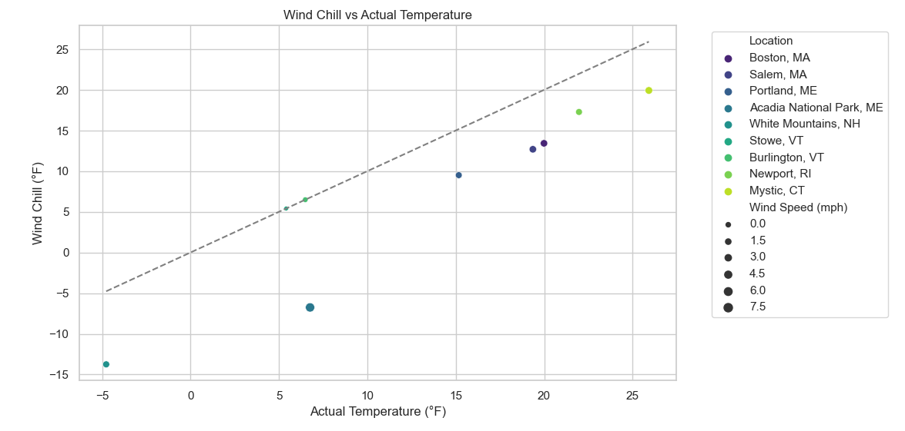
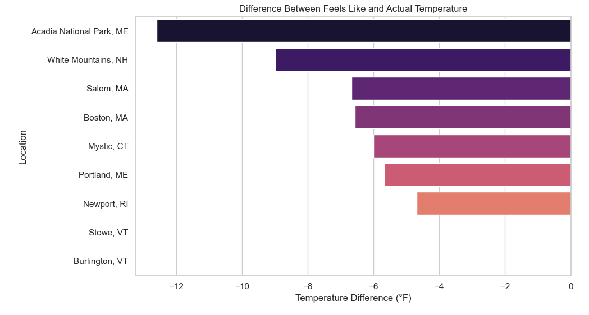

# New England Winter Travel Weather Analysis ❄️

This project analyzes live winter weather data for popular New England travel destinations using the **OpenWeatherMap API**. It demonstrates **data ingestion, transformation, analysis, and visualization** in a Jupyter Notebook.

## Features

- **Live API Data**: Fetches temperature, feels-like, humidity, wind speed, and snow information.
- **Derived Metrics**:  
  - Feels-Like vs Actual Temperature  
  - Temperature Difference  
  - Snow Indicator (Yes/No)  
  - Temperature Category (Freezing / Cold / Mild)  
  - Wind Chill Calculation
- **Visualizations**:  
  - Snow Presence vs Temperature (Boxplot)  
  - Wind Chill vs Actual Temperature (Scatterplot)  
  - Temperature Difference (Barplot)  
  - Temperature Category Distribution (Countplot)
- **Actionable Insights**:  
  - Identify coldest snow-friendly destinations  
  - Understand the impact of wind on perceived temperature  
  - Plan trips based on “feels-like” temperature  

## Technologies Used

- Python 3.x
- Jupyter Notebook
- Pandas, Matplotlib, Seaborn
- OpenWeatherMap API

## Project Structure

New_England_Travel_Weather_App/
│
├── notebooks/
│ └── New_England_Winter_Weather_Analysis.ipynb
├── .env # Stores API key (not tracked in GitHub)
├── requirements.txt
└── README.md

## Visualizations

### Temperature Category Distribution


### Snow Presence vs Temperature


### Wind Chill vs Actual Temperature


### Temperature Difference



## How to Run

1. Install dependencies:

```bash
pip install -r requirements.txt

2. Add your OpenWeatherMap API key in a .env file in the project root:

OPENWEATHER_API_KEY=YOUR_API_KEY


3. Launch Jupyter Notebook:

jupyter notebook


4. Open the notebook:

notebooks/New_England_Winter_Weather_Analysis.ipynb


Run all cells to see live data analysis and visualizations